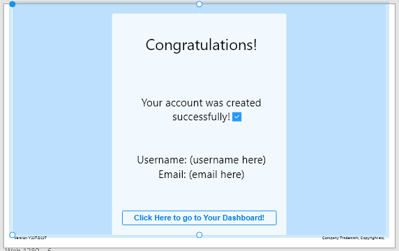
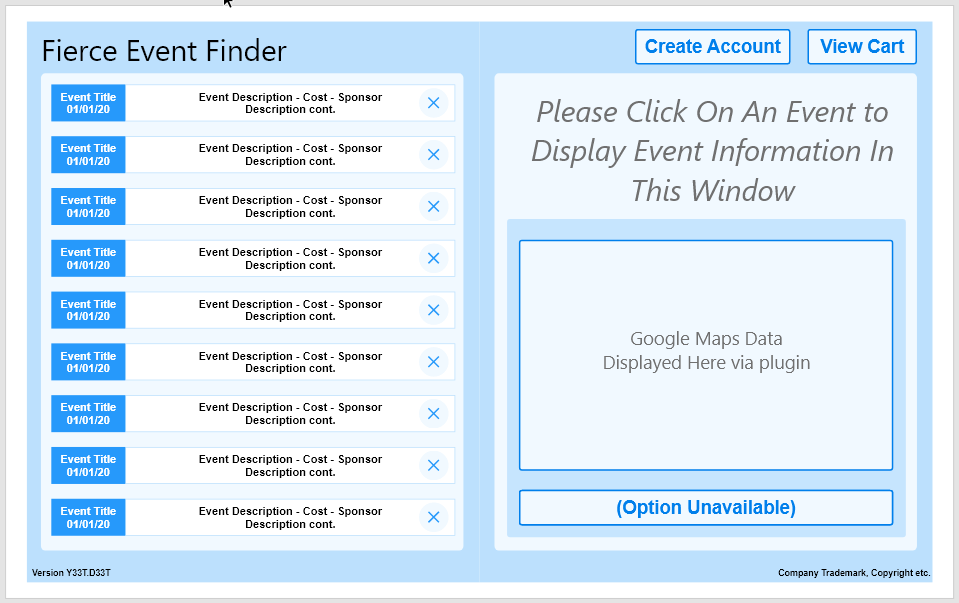
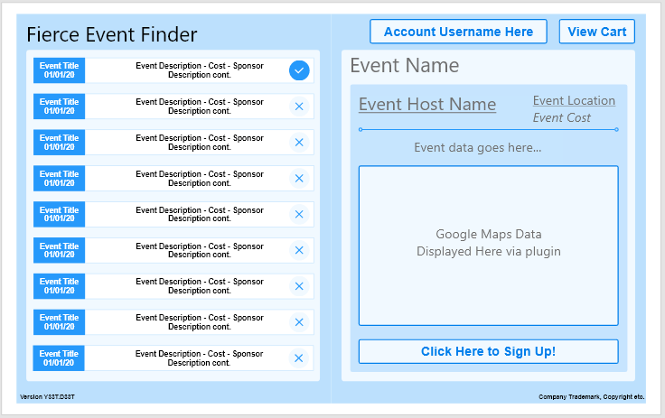
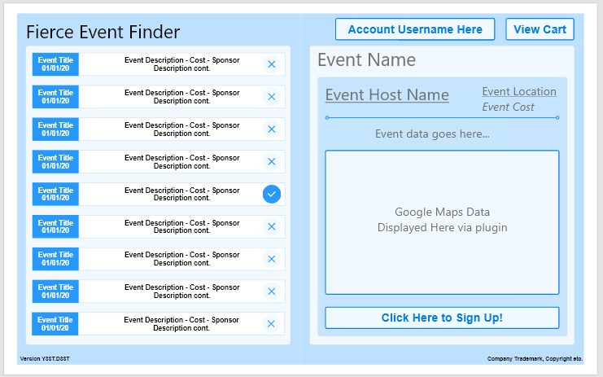
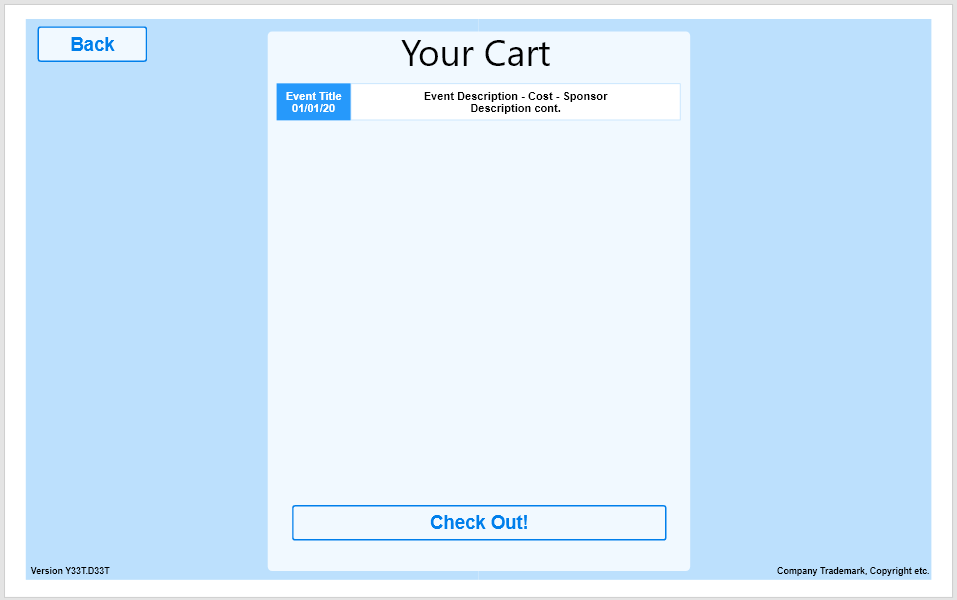
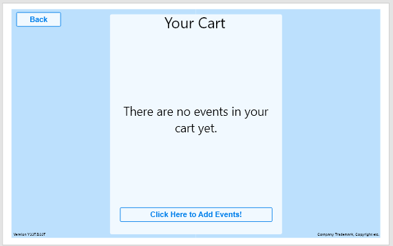

# Phase II: User-Centered Design

We're fixing this because we screwed up the phases.

## Registration Confirmation
  

#### Explanation
> This is the page you arrive to after registration. We want the registration process to be quick, easy and painless. One of the important aspects of registration is confirmation, as we want users to know they successfully registered. As our project is intended to make obtaining admission for key/multiple events easy, we need the software to be error tolerant.

  
-----------
## Homepage / New User Landing
  

#### Explanation
> This is the landing page. To make the application *effective* in terms of solving the issue, the homepage is also the event selection page. Users will scroll through all known events listed by distance and date, to find events that interest them.
  
-----------
## Event Selection
  

#### Explanation
> Once an event has been selected, the event information window on the right half of the screen will display detailed event information as well as attempt to obtain a google map view of the area the event is hosted in. This allows users to research information on their event without more than scrolling and a click.

#### Data Pertaining to Event Selection
> As the data showed that users were spending way too much time on registration, we noticed a lot of users would browse event details trying to find out more about their events. This lead to users being redirected to event pages, flipping through multiple tabs, looking up the google maps location of the event, reading start times and dates, and many other inefficient things across, sometimes, multiple webpages. This showed us that we need to include as much information about the event as possible without all the redirecting, and without also cluttering up the workspace.

#### Pertinent Personas
> All personas are directly affected by this data, however the group who stands out most would be *The Curious*. The curious user wants to know about what events are available, where they are at, when they are happening and many other details. They want to feel well informed without feeling obligated to build a cart or register. This, we chose to make a preview section. When an event is selected, it's added to the cart silently, while the user is offered a detailed glimpse at the event that offers a little bit more than just a location and an event title.
  
-----------
## Multiple Events
  

#### Explanation
> More than one event can be selected, however to avoid exponential amounts of repetitive wireframe setups, our wireframe model only depicts being able to register for one event at a time. This way, we only had to write 9 different slides. If we demonstrated the ability to register for multiple events, we would have had to have 23,410 slides. Long story short, the depiction only shows single event registration. Once an event is selected, the sign up button becomes available. This stores the event into the cart, without the viewer having to go to registration, so they can continue to scroll the events list and stock up on events they want to know more about.

#### Data Pertaining to Multiple Event Selection
> We learned during our data collection phase that users, on average, attended approximately 2 events, while our most adventurous group attended 17 events recently. This told us that it was important that multiple events were considered. This directly affected the design of the homepage to allow the selection of multiple events prior to being offered registration or check out. 

#### Pertinent Personas
> This feature is greatly influenced by the persona of *The Veteran*. This persona group encases persons who attend multiple events, and go to events regularly. They'll more than likely be registering for multiple events, and want to do so in a quick manner. Whether they compete in the same type of event, events all under one host, or a span of multiple events under multiple hosts, the checkout procedure would remain the same: Select all the events of interest, register once.
  
-----------
## Viewing the Cart & Modifying Appropriately
  

#### Explanation
> Once the user has selected their events, clicking on View Cart gives them a view of all the events they've selected (albeit shortened). They can then modify their cart based on which events they really want to attend, and then proceed to the checkout.

#### Data Pertaining to Registration
> In *Phase I* we found that the average user was spending 3-5 minutes registering for a single event. As one of the primary goals of Event Finder is to decrease the amount of time people spend registering for an event, or drastically reducing the amount of time it takes to register for multiple events (especially across multiple vendors), it was important to design the cart to be easily modifiable and easy to use. The cart has to be *effective* and *learnable*.

#### Pertinent Personas
> We also found in *Phase II*, specifically, that the Free Spirit persona was likely to refund their purchase if their registrations took too long. In terms of using our software, this persona would likely leave the application if the registration process was too complicated or not *efficient* in solving the problem of slow and ineffective registrations.

  
-----------
## External Registration
  

#### Explanation
> For the sake of the time window of this project, we plan to launch using an external eCommerce source, or open up various links so the user can go to each event host's website to register for the event. The website would keep track of each registration to ensure the user seamlessly can register for their events.

#### Data Pertaining to Outsourcing
> There really is no data or methods behind this. We don't have the time to extend our service to include an entire eCommerce suite and backend for sales, so it's just not included.
